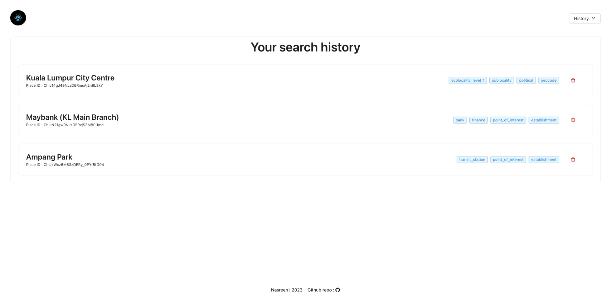

# React Assessment

This project was bootstrapped with [Create React App](https://github.com/facebook/create-react-app). It's a simple location finder where a user can find a location and a marker appears on the map. There is also a history section where users can see their search history and can delete their past searches.

## Main maps page

Seacrhing location using Google Autocomplete

## History page

## Getting Started
1. Run `npm install`
2. `npm start` and you're ready to go!
## Available Scripts

In the project directory, you can run:

### `npm start`

Runs the app in the development mode.\
Open [http://localhost:3000](http://localhost:3000) to view it in your browser.

The page will reload when you make changes.\
You may also see any lint errors in the console.

### `npm run deploy`

Deploys the latest build to github pages repo.
